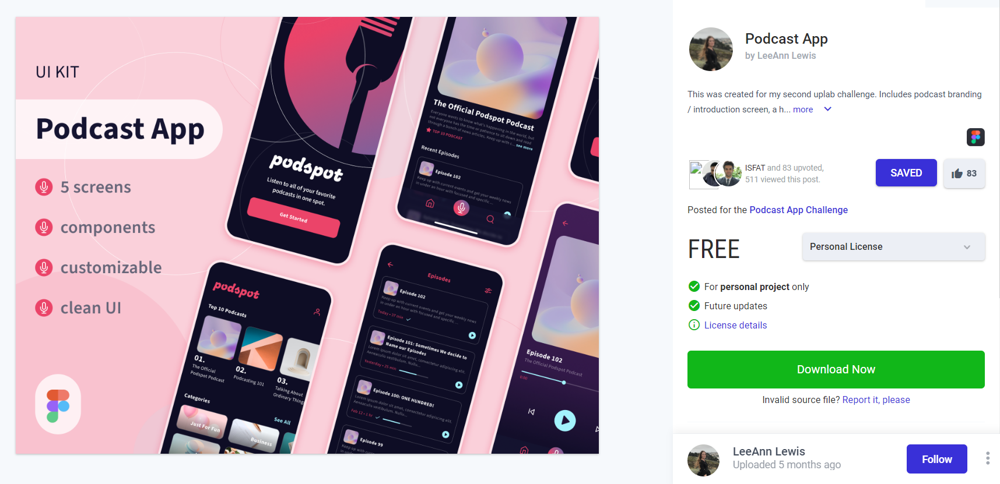

# Projeto Podcast APP

Este projeto foi criado com o propósito de práticar o **levantamento de requisito** de um projeto. Onde foi desenvolvido através do curso método PDA, levando em consideração analisar um projeto do tipo Figma retirado do site UpsLabs onde vários designer tem a possibilidade de subir os seus projetos. Com isso é possivel demostrar a analise do projeto PodcastApp onde através do protótipo irei analisar os requisitos desejaveis para este projeto realizado no curso.

## Protótipo

- Protótipo do Figma [PodcatApp](https://www.uplabs.com/posts/podcast-app-27e7dba2-b5d6-40f8-be0f-52d6710b9af7)

## Analise do projeto

A imagem a baixo irá indicar como foi feita a análise deste projeto, onde foi utilizado o **MIRO** para fazer a análise de forma visual.

1. Indicação da imagem a ser analisada
2. Indicação de qual Requerimento iremos analisar, indicando seu número e nome
3. Descrição em alto da funcionalidade, indicando o usuário que irá utilizar, a funcionalidade desejada e o porque da existencia deste funcionalidade.
4. Listagem das regras de negócio a serem implementadas.

### Referência da analise

- [REQ 1 Exibir Splash Screen](./img/req_01.png)

- [REQ 2 Criar padrão de Header](./img/req_02.png)

- [REQ 3 TOP 10 Podcast](./img/req_03.png)

- [REQ 4 Exibir as categorias de Podcast](./img/req_04.png)

- [REQ 5 Exibir os Podcast recomendado](./img/req_05.png)

- [REQ 6 Tela Inicial podcast](./img/req_06.png)

- [REQ 7 Exibir a lista de todos os episódio](./img/req_07.png)

- [REQ 8 Exibição do Player de execução do Podcast](./img/req_08.png)

### Jira

Utilizei a ferramenta **jira** no curso para aprender mais sobre como criar o roteiro e elaborar os **epics** e **user story** para ter como base o funcionamento do **Quadro Kanban**.

1. Indicação da criação do epic
2. Indicação da elaboração da user story
