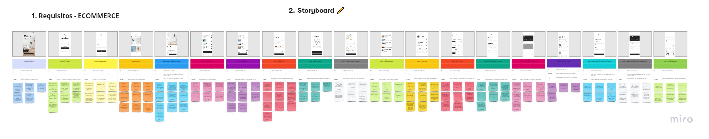
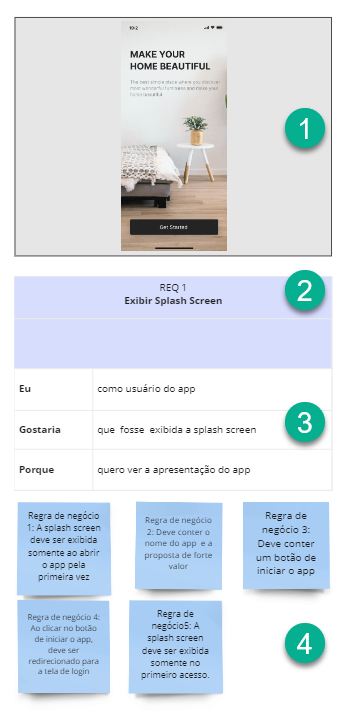
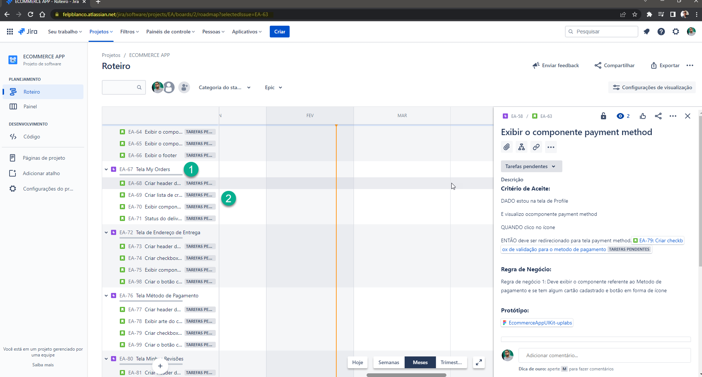

# Projeto Podcast APP

Este projeto foi criado com o propósito de práticar o **levantamento de requisito** de um projeto. Onde foi levado em consideração analisar um projeto do tipo Figma retirado do site UpsLabs onde vários designer tem a possibilidade de subir os seus projetos. Com isso irei demostrar a analise do projeto Ecommerce App onde através do protótipo analisei os requisitos desejaveis para este projeto.

## Protótipo

- Protótipo do Figma [Ecommerce App](https://www.uplabs.com/posts/ecommerce-app-ui-kit-17b19d87-a38d-4ee9-bcea-91410ba3f1f7)

## Analise do projeto

A imagem a baixo irá indicar como foi feita a análise deste projeto, onde foi utilizado o **MIRO** para fazer a análise de forma visual.

1. Indicação da imagem a ser analisada
2. Indicação de qual Requerimento iremos analisar, indicando seu número e nome
3. Descrição em alto da funcionalidade, indicando o usuário que irá utilizar, a funcionalidade desejada e o porque da existencia deste funcionalidade.
4. Listagem das regras de negócio a serem implementadas.

### Referência da analise

- [REQ 1 Exibir Splash Screen](./img/req_01.png)

- [REQ 2 Exibir tela de login](./img/req_02.png)

- [REQ 3 Exibir formulário Sign up](./img/req_03.png)

- [REQ 4 Exibir tela Home](./img/req_04.png)

- [REQ 5 Exibir tela do produto selecionado](./img/req_05.png)

- [REQ 6 Exibir Tela de Favoritos](./img/req_06.png)

- [REQ 7 Exibir Tela My cart](./img//req_07.png)

- [REQ 8 Exibir Tela Check out](./img/req_08.png)

- [REQ 9 Exibir Tela de Sucesso](./img/req_09.png)

- [REQ 10 Exibir Tela classificação e revisão](./img/req_10.png)

- [REQ 11 Exibir Tela de Notificação](./img/req_11.png)

- [REQ 12 Exibir Tela de Perfil](./img/req_12.png)

- [REQ 13 Exibir Tela My Orders](./img/req_13.png)

- [REQ 14 Exibir Tela de Endereço de Entrega](./img/req_14.png)

- [REQ 15 Exibir Tela Metodo de Pagamento](./img//req_15.png)

- [REQ 16 Exibir Tela Minhas Revisões](./img/req_16.png)

- [REQ 17 Exibir Tela adicionar um metodo de pagamento](./img//req_17.png)

- [REQ 18 Exibir Tela Configurações](./img/req_18.png)

- [REQ 19 Exibir Tela de Sucesso](./img/req_19.png)

### Jira

Utilizei a ferramenta **jira** no curso para aprender mais sobre como criar o roteiro e elaborar os **epics** e **user story** para ter como base o funcionamento do **Quadro Kanban**.

1. Indicação da criação do epic
2. Indicação da elaboração da user story
