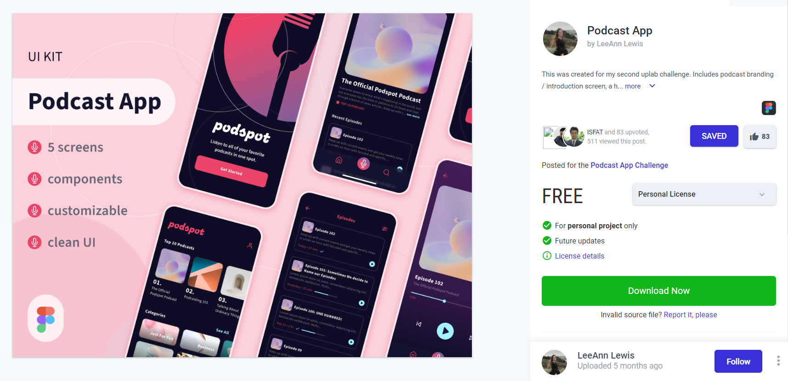
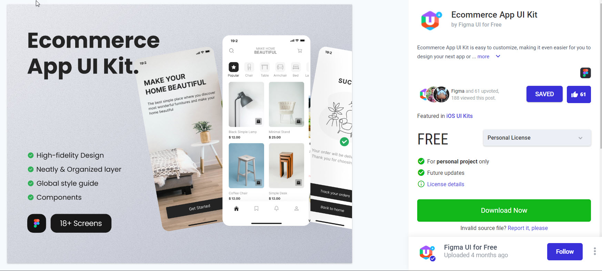

# Portfólio QA

Este projeto tem como finalidade mostrar o meu trabalho de análise de requisitos e plano de teste

Neste repositório você irá encontrar a analise de 3 (3) projetos, sendo um:

- Analise de requisitos de dois protótipo Figma diferente
- Plano de Teste de um site

## Portfólio Analise de Requisitos

- Protótipo do Figma [PodcatApp](https://www.uplabs.com/posts/podcast-app-27e7dba2-b5d6-40f8-be0f-52d6710b9af7)

- Protótipo do Figma [Ecommerce App](https://www.uplabs.com/posts/ecommerce-app-ui-kit-17b19d87-a38d-4ee9-bcea-91410ba3f1f7)

## Portfólio Plano de Teste

- Site utilizado para elaboração do Plano [Saucedemo](https://www.saucedemo.com)

