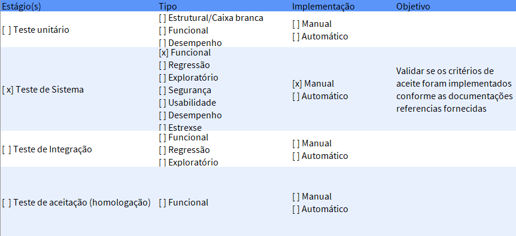

# Projeto Saucedemo

Este projeto foi criado com o propósito de práticar a criação e execução do **Plano de Teste** de um projeto. Onde foi levado em consideração analisar um site já existente, realizar levantamento dos seus requisitos, criação de suites e casos de teste para execução.

## Ferramentas

- Site utilizado para elaboração do Plano [Saucedemo](https://www.saucedemo.com)

- Excell para criação do Plano de Teste

## Plano de Teste

### Apresentação do Plano

Na aba Introdução da Planilha irá conter todas as informações bases do projeto.

### Escopo do Teste

Na aba Escopo do testes irá conter os requisitos, os tipos de teste e por qual meio será testado

### Estratégia de teste

Na aba Estratégia de teste irá conter o nível de teste qual tipo se é funcional ou não, se é manual ou automático e o objetivo.

### Ambiente de teste

Na aba Ambiente de teste irá conter as configuração do tipo de ambiente para realizar os testes.

### Critério de Aceite

Na aba Critério de Aceite irá conter as informações do que vai ser coberto, quando parar de testar, quando reportar as falhas e quando retestar

### Apresentando a Suite

Na aba Suite\_(nome do requisito) irá conter todas as informações necessárias para execução dos testes vinculadas a Suíte.

Entre eles:

- Objetivo do teste:
- Tempo de execução:
- Protótipo:
- Pré condicação:
- Dados necessário:
- Critério de aceite:
- Requisitos:
- Casos de teste:
- Prioridade:
- Severidade

